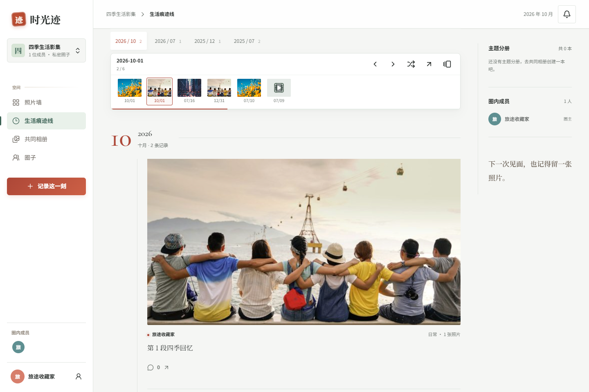
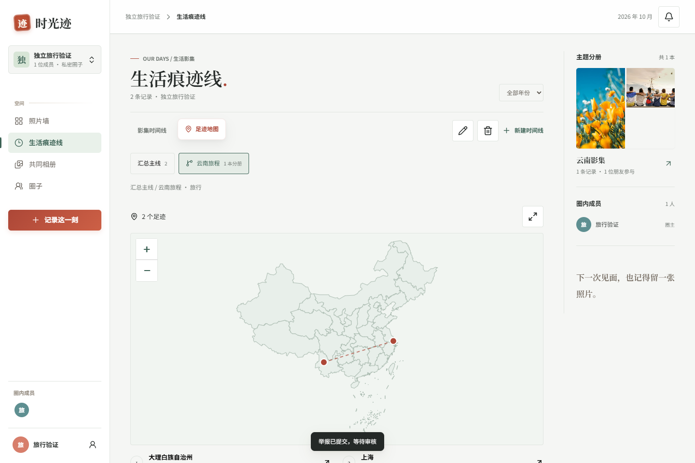
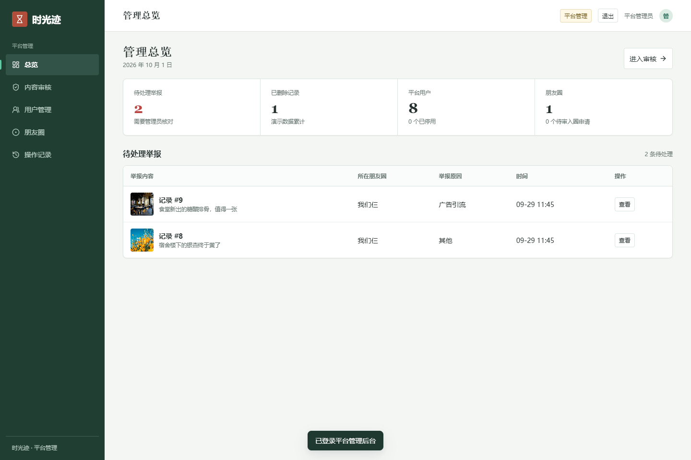

# 时光迹 · Shiguangji

和朋友一起记录日常，把照片、旅行和共同经历整理成可以回看的生活影集。

[](https://github.com/drdghvvhg766ease/shiguangji/actions/workflows/ci.yml)


时光迹是一个基于 **Vue 3 + FastAPI + MySQL** 的朋友照片与生活记录平台，包含用户端、管理端和后端 API。它以私密朋友圈为基础，将照片墙、生活时间线、共同相册和足迹地图连接起来。内容按圈子成员权限访问；用户端与管理端使用独立登录会话。

[快速开始](#快速开始) · [功能介绍](#功能介绍) · [目录结构](#目录结构) · [测试与自动检查](#测试与自动检查) · [部署说明](./deploy/DEPLOY.md) · [参与开发](./CONTRIBUTING.md)

## 项目预览

生活时间线支持照片胶片导航、上一刻 / 下一刻和随机回忆。以下图片来自本地演示与测试场景。



<details>
<summary>查看足迹地图和管理端</summary>

**足迹地图**：按照生活日期连接记录地点，支持城市搜索、地图选点与时间线筛选。



**管理端**：查看平台统计、处理举报、管理用户与朋友圈，并保留管理操作记录。



</details>

## 功能介绍

| 模块 | 已实现功能 |
| --- | --- |
| 账号与个人主页 | 注册 / 登录、头像裁剪、昵称与密码设置、个人操作时间线、消息中心 |
| 私密朋友圈 | 创建与切换圈子、邀请码加入、入圈审核、圈主 / 管理员 / 成员角色、公告、转让与解散 |
| 照片与视频记录 | 照片排序、真实上传进度、标签与生活日期、内容编辑、原文件下载、视频播放与 Range 拖动 |
| 生活时间线 | 汇总主线、多级分支、年份筛选、照片胶片导航、随机回忆、操作历史保留 |
| 共同相册与主题分册 | 按成员 / 月份 / 标签筛选、拼贴封面、接力题目、关联时间线、猜照片 |
| 足迹地图 | 本地中国省份边界、370 个城市 / 地区中心搜索、地点打点、经纬度输入、按日期连线 |
| 互动与收藏 | 点赞、评论与回复、分类收藏夹、向指定圈子分享收藏、消息已读 |
| 平台管理 | 举报审核、账号停用 / 恢复、用户与圈子管理、操作审计、独立管理会话 |

照片原文件按上传字节保存，下载可用 SHA-256 校验；媒体通过鉴权接口读取。删除分册或时间线保留原记录，删除朋友圈会清理圈内记录与媒体。记录和分册同时关联多条时间线的功能暂未实现。

## 技术栈

| 层 | 技术 |
| --- | --- |
| 用户端 / 管理端 | Vue 3、Vite、Pinia、Axios、Lucide |
| 地图与动效 | Leaflet、本地地图数据、tsParticles；支持减少动态效果偏好 |
| 后端 API | FastAPI、Pydantic、SQLAlchemy 2、JWT HttpOnly Cookie |
| 数据库 | MySQL 8.4、utf8mb4、PyMySQL |
| 媒体处理 | Pillow 缩略图、SHA-256、可选 FFmpeg / FFprobe 视频封面与时长检查 |
| 测试与部署 | pytest、浏览器检查脚本、GitHub Actions、Nginx、systemd |

依赖与选型依据见 [TECH_SELECTION.md](./TECH_SELECTION.md)，地图数据出处见 [地图说明](./frontend/user/public/maps/README.md)。

## 快速开始

### 1. 准备环境并获取代码

推荐环境：**Python 3.12、Node.js 24 LTS、MySQL 8.4**。FFmpeg 为可选组件；未安装时跳过视频封面与时长探测，仍可保存、播放和下载原视频。

```bash
git clone https://github.com/drdghvvhg766ease/shiguangji.git
cd shiguangji
```

下方命令从克隆后的项目目录开始执行，不依赖固定磁盘位置。

### 2. 配置后端

Windows / PowerShell：

```powershell
cd backend
python -m venv .venv
.\.venv\Scripts\python.exe -m pip install -r requirements-dev.txt
Copy-Item .env.example .env
```

<details>
<summary>Linux / macOS 命令</summary>

```bash
cd backend
python3 -m venv .venv
.venv/bin/python -m pip install -r requirements-dev.txt
cp .env.example .env
```

后续命令中的 `.\.venv\Scripts\python.exe` 对应 `.venv/bin/python`。

</details>

首次安装复制 `.env.example` 后，编辑 `backend/.env`：

| 配置 | 用途 |
| --- | --- |
| `MYSQL_HOST` / `MYSQL_PORT` | MySQL 地址与端口，默认 `127.0.0.1:3306` |
| `MYSQL_USER` / `MYSQL_PASSWORD` | 你的数据库账号与密码 |
| `MYSQL_DATABASE` | 数据库名，默认 `shiguangji` |
| `JWT_SECRET` | 替换为随机密钥，可用 `python -c "import secrets; print(secrets.token_urlsafe(48))"` 生成 |
| `ALLOWED_ORIGINS` | 允许的前端来源，逗号分隔；示例已包含本地用户端和管理端 |
| `COOKIE_SECURE` | 本地 HTTP 使用 `false`，生产 HTTPS 使用 `true` |

`.env` 不会提交到 Git。数据库账号需要有目标数据库的建表与读写权限；自动建库还需要 `CREATE DATABASE` 权限，也可先手动创建：

```sql
CREATE DATABASE IF NOT EXISTS shiguangji
  CHARACTER SET utf8mb4 COLLATE utf8mb4_unicode_ci;
```

初始化数据表并启动 API：

```powershell
.\.venv\Scripts\python.exe -c "from app.database import ensure_database, init_db; ensure_database(); init_db()"
.\.venv\Scripts\python.exe -m uvicorn app.main:app --host 127.0.0.1 --port 8001
```

### 3. 安装并启动前端

另开一个终端，从项目根目录执行：

```bash
cd frontend
npm run ci:apps
npm run dev
```

再开一个终端，在 `frontend` 目录启动管理端：

```bash
npm run dev:admin
```

| 服务 | 本地地址 |
| --- | --- |
| 用户端 | http://localhost:5173 |
| 管理端 | http://localhost:5174 |
| API 文档 | http://127.0.0.1:8001/docs |
| 健康检查 | http://127.0.0.1:8001/api/health |

两套前端通过 Vite 将 `/api` 请求代理到 `8001` 端口。Windows 安装并配置好依赖后，也可在项目根目录运行 `start-dev.bat`，同时启动三个服务。

### 4. 初始化演示账号（可选）

在后端终端停止 API，或另开一个终端进入 `backend`，执行：

```powershell
.\.venv\Scripts\python.exe seed.py
.\.venv\Scripts\python.exe seed_admin.py
```

`seed.py` 创建演示成员、朋友圈、分册和合成照片；`seed_admin.py` 创建管理账号和演示举报。管理端演示需要先执行 `seed_admin.py`。

| 账号 | 密码 | 用途 |
| --- | --- | --- |
| `demo_a` | `demo1234` | 「我们仨」圈主 |
| `demo_b` | `demo1234` | 圈内成员 |
| `admin` | `admin123` | 平台管理端 |

演示邀请码为 `DEMO2026`。以上账号用于本地演示与测试，正式部署请使用自己的账号与密码。

### 5. 升级已有数据库

新建数据库可直接使用当前模型建表。已有旧版本数据库先备份，再进入 `backend` 按顺序执行：

```powershell
.\.venv\Scripts\python.exe migrate_admin.py
.\.venv\Scripts\python.exe migrate_reports.py
.\.venv\Scripts\python.exe migrate_lines.py
.\.venv\Scripts\python.exe migrate_social.py
.\.venv\Scripts\python.exe migrate_activity.py
```

举报迁移会在 `backend/backups` 保存备份；操作历史迁移仅回填旧数据中可以确认的事件。详细记录见 [工作记录](./docs/2026-10-01-工作记录.md)。

## 目录结构

```text
shiguangji/
├─ frontend/                 前端总目录
│  ├─ user/                  用户端 Vue 应用
│  ├─ admin/                 管理端 Vue 应用
│  └─ package.json           两端统一安装、启动、构建命令
├─ backend/                  后端总目录
│  ├─ app/                   API、数据模型、认证与媒体处理
│  ├─ .env.example           环境变量模板
│  ├─ requirements*.txt      Python 依赖
│  ├─ migrate_*.py           数据迁移
│  ├─ seed*.py               演示数据初始化
│  ├─ test_*.py              API 集成测试
│  └─ uploads/               本地媒体目录，不提交到 Git
├─ .github/workflows/        GitHub 自动检查
├─ deploy/                   Nginx、systemd 与部署说明
├─ docs/                     需求、工作记录与项目截图
├─ scripts/                  城市数据生成等辅助脚本
├─ tests/                    浏览器检查与共享测试媒体
├─ CONTRIBUTING.md           开发与提交说明
└─ start-dev.bat             Windows 一键启动
```

## 测试与自动检查

### 本地检查

在 `frontend` 目录执行 `npm run build`，构建用户端与管理端；产物分别位于 `frontend/user/dist` 和 `frontend/admin/dist`。

后端测试需要已启动的 API，以及完成 `seed.py`、`seed_admin.py` 初始化的测试数据库。在 `backend` 目录执行：

```powershell
$env:API_BASE = 'http://127.0.0.1:8001'
.\.venv\Scripts\python.exe -m pytest test_enhancements.py test_social.py -q
```

测试会创建账号、朋友圈和媒体并执行清理，请指向独立测试数据库。覆盖登录会话隔离、权限、举报、时间线、媒体清理、视频 Range、个人设置、消息与收藏等流程。

`tests/*.cjs` 提供额外的浏览器检查，需要安装 Playwright、Microsoft Edge，并启动用户端、管理端和 API。可通过 `PLAYWRIGHT_PATH` 指定已有 Playwright 模块位置；具体场景见 [工作记录](./docs/2026-10-01-工作记录.md)。

### GitHub Actions

[CI 工作流](https://github.com/drdghvvhg766ease/shiguangji/actions/workflows/ci.yml) 在推送 `main`、提交面向 `main` 的 Pull Request 或手动触发时运行：

- **前端构建**：按两套锁文件安装依赖，构建用户端与管理端，上传构建产物。
- **后端测试**：启动独立 MySQL 8.4 服务，初始化测试账号，检查 Python 语法与依赖，执行现有 API 集成测试。
- **结果保留**：上传测试报告与 API 日志，便于在 Actions 页面排查失败。

## 部署

生产部署使用 Nginx 托管前端并代理 API，systemd 管理后端进程。用户端与管理端可部署到各自站点；配置与目录规划见 [deploy/DEPLOY.md](./deploy/DEPLOY.md)。

媒体限制为每条最多 9 张照片（单张 10 MB），或 1 段短视频（100 MB / 3 分钟）。部署时启用 HTTPS、配置实际前端来源，并备份数据库与 `backend/uploads`。Windows 视频工具安装说明见 [install-ffmpeg.ps1](./deploy/install-ffmpeg.ps1)。

## 常见问题

- **数据库连接失败**：确认 MySQL 已启动，`.env` 中账号、密码和端口正确；从 `backend` 目录启动 API。
- **前端接口不可用**：确认 API 监听 `8001`，前端终端显示预期的 `5173` / `5174` 端口。
- **访问返回 403**：检查当前账号是否为圈内成员，以及 `ALLOWED_ORIGINS` 是否包含实际前端来源。
- **管理端无法登录**：先在测试数据库执行 `seed_admin.py`；普通成员账号没有平台管理权限。
- **没有视频封面**：安装 FFmpeg / FFprobe 并确认它们在 `PATH` 中，再上传视频。
- **依赖下载较慢**：可进入两套前端目录分别执行 `npm ci --registry=https://registry.npmmirror.com`；Python 可使用 `pip install -r requirements-dev.txt -i https://pypi.tuna.tsinghua.edu.cn/simple`。

## 参与开发

欢迎通过 [Issues](https://github.com/drdghvvhg766ease/shiguangji/issues) 反馈问题或提交 Pull Request。环境准备、验证方式和提交约定见 [CONTRIBUTING.md](./CONTRIBUTING.md)。
